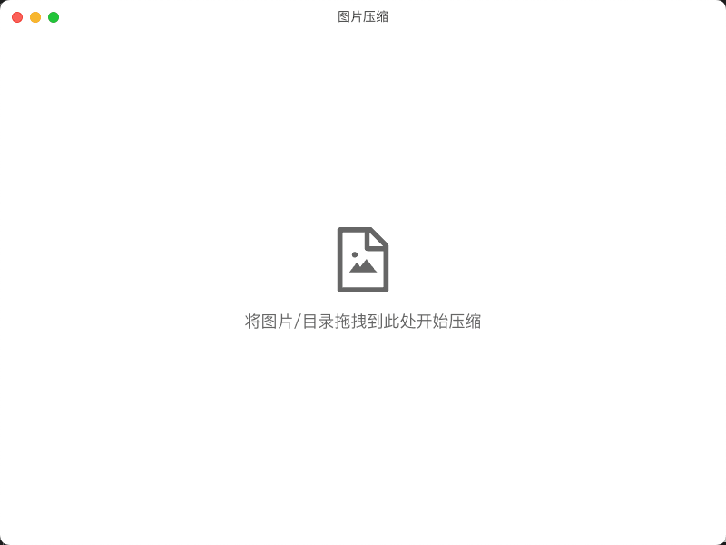
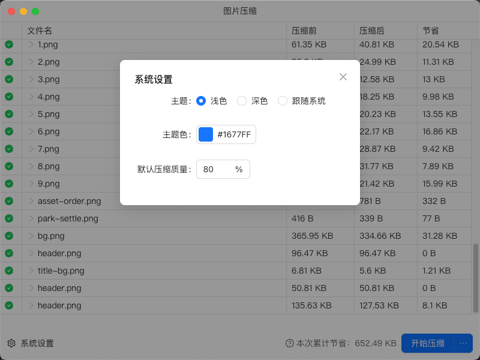
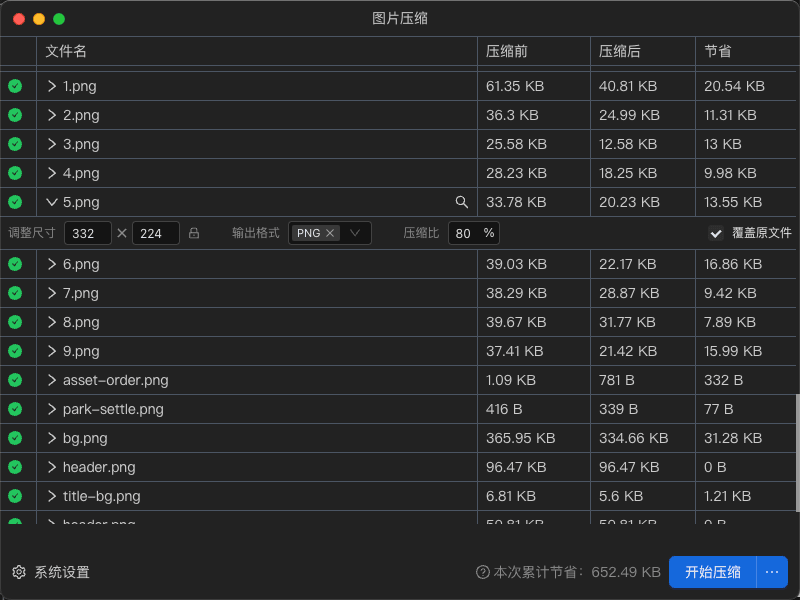

# 图片压缩 🖼️

一款模仿 ImageOptim 的图片压缩工具 🛠️

*原本打算使用 Tauri 开发的，但是实在是 libvips 和 pngquant 的动态、静态编译不太懂，所以就放弃了*

## 简介 📝

这是一个使用 Electron 和 Sharp 开发的图片压缩应用程序，专为前端开发者设计，用于批量压缩图片。

## 预览 👀

| | |
|---|---|
|  |  |
|  |  |

## 主要特点 ✨

- 简单易用的界面 🖥️
- 批量处理图片 📚
- 高效的压缩算法 🚀
- 跨平台支持 (Windows, macOS, Linux) 💻

## 使用方法 🔧

1. 从 [Release](https://github.com/erguotou520/image-compress/releases) 下载当前操作系统的最新版本
2. 打开应用程序（应用未签名，所以可能会遇到无法打开等问题，Mac 需要允许从非 App Store 安装应用并执行`sudo xattr -dr com.apple.quarantine /Applications/image-compress.app`，或者本地编译尝试）
3. 拖拽图片或文件夹到应用窗口
4. 选择压缩设置
5. 点击"开始压缩"按钮
6. 等待压缩完成，保存结果

## 技术栈 🔨

- Electron: 跨平台桌面应用开发框架
- Sharp: 高性能图片处理库
- SVGO: 用于优化 SVG 文件的工具
- React: 用户界面开发

## 贡献 🤝

欢迎提交 issues 和 pull requests 来帮助改进这个项目！

## 许可证 📄

本项目采用 MIT 许可证。详情请查看 [LICENSE](LICENSE) 文件。

